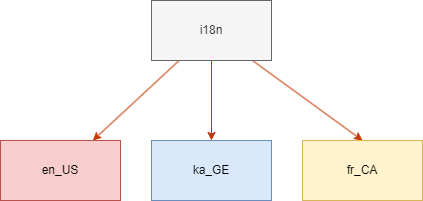

# ანგულარის i18n

როცა გვსურს ანგულარში სხვადასხვა ენების შემოტანა, ამ დროს წავაწყდებით ორ ტერმინს: ინტერნაციონალიზაციას და ლოკალიზაციას. ეს ტერმინები
ერთმანეთთან კავშირში არიან თუმცა ისინი ერთს და იმავეს არ ნიშნავენ. ინტერნაციონალიზაცია მეტწილადად მოიხსენიება, როგორც `i18n`. ეს არის პროცესი,
როცა ვამზადებთ და დიზაინს ვარჩევთ ჩვენი აპლიკაციისთვის, რომელსაც ექნება მრავალი ენის მხარდაჭერა. ინტერნაციონალიზაციის ნაწილი მოიცავს
შემდგომ ეტაპებს:

- დავყოთ ჩვენი აპლიკაციის კონტენტები თარგმანისთვის და მოვამზადოთ რენდერის პროცესისთვის.
- განვანაახლოთ ჩვენი აპლიკაცია ორმხრივი ტექსტებისთვის: `ltr` (მარცხნიდან მარჯვნივ) ან `rtl` (მარჯვნიდან მარცხნივ).

შემდგომ უნდა გადავიდეთ ლოკალიზაციის პროცესზე. ლოკალიზაცია ეს არის პროცესი, როცა ვქმნით ვერსიებს
სხვადასხვა ტიპის ლოკალისთვის. ლოკალში (`locale`) იგულისხმება, ამ შემთხვევაში, შემდგომი ასპექტები:

- სხვადასხვა ტექსტების თარგმანი.
- სხვადასხვა ადგილმდებარეობის მიხედვით განსხვავებული დროის ფორმატები, მაგალითად: `7/22/2002` ან `22/7/2022`.
- სხვადასხვა ტიპის რიცხვები და ვალუტები.

ლოკალის ფორმატია: `{ენის_id}-{ენის_გაფართოვება}`

მაგალითად:

- `en-US` (English, The United States)
- `ka-GE` (ქართული, საქართველო)
- `fr-CA` (French, Canada)

ასერომ, თუ ინტერნაციონალიზაცია გულისხმობს ზოგადად აპლიკაციაში სხვადასხვა ენებისთვის მხარდაჭერის შემოტანას, ლოკალიზაცია გულისხმობს აპლიკაციის
კონკრეტულ ენაზე მომზადებას.



ინტერნაციონალიზაციის პროცესი საჭიროა რეალურად მოხდეს ერთხელ და შემდგომ მთლიანი აპლიკაცია შედგიძლიათ გახადოთ ლოკალური იმდენი ენისთვის,
რამდენი ენისთვისაც გჭირდებათ, კოდის ცვლილების გარეშე. თუ გაზრდით თქვენს აპლიკაციას, აუცილებლად უნდა გაატაროთ ინტერნაციონალიზაციაში ახალი გვერდები.

## ინსტალიაცია

ინტერნაციონალიზაციის პაკეტის დასაინსტალირებლად, დაგვჭირდება ანგულარის CLI-ს გამოყენება:

```sh
ng add @angular/localize
```

ინსტალაციის დროს ამოგვიგდებს ეთანხმებით თუ არა ანგულარის პაკეტის დაინსტალირებას, რასაც უნდა დავეთანხმოთ.

შემდგომ შევუდგეთ angular.json-ში `build`-ის ქვეშ `i18n` ველის დამატებას.

```json
{
  "projects": {
    // ...
    "project_name": {
      // ...
      "i18n": {
        "sourceLocale": "en-US",
        "locales": { "ka-GE": "src/locale/messages.ka.xlf" }
      },
      // ...
      "architect": {
        // ...
        "build": {
          // ...
          "options": {
            // ...
            "localize": ["ka-GE"]
          }
        }
      }
    }
  }
}
```

ამ კოდის დამატებით ვამბობთ თუ რომელი ლოკალების ჩატვირთვის შესაძლებლობა გვექნება. `sourceLocale` არის აპლიკაციის მთავარი ენა, ანუ რა ენაზე დავიწყეთ აპლიკაციის აწყობა. `locale` ობიექტი ამ შემთხვევაში განსაზღვრავს თუ ჩვენს აპლიკაციას რომელი ლოკალების მხარდაჭერა გააჩნია და ამავდროულად სად იქნება კონკრეტული ლოკალი მოთავსებული.
ამ შემთხვევაში დავამატეთ "`ka-GE`", რომელიც შესაძლებლობას გვაძლევს, რომ ქართული ლოკალი მოვზადოთ, ხოლო მასზე მინიჭებული მისამართი მიუთითებს თუ სად იქნება
მოთავსებული ინფორმაცია ამ ლოკალის შესახებ, ეს ფაილი ჯერ არ შეგვიქმნია მაგრამ მალე შევქმნით. `localize` მასივის დამატებით ანგულარს ვეუბნებით,
თუ რომელი ლოკალი შექმნას, როცა მოხდება ლოკალიზაციის პროცესი აპლიკაციაში.

მარტივად დავარედაქტიროთ `app.component.html`:

```html
<h1>Page header</h1>

```

ახლა უნდა დავიწყოთ ლოკალიზაციისთვის მომზადება ანუ იმ ადგილების მონიშვნა, რომლის ლოკალიზაცია გვსურს, ამას `html`-ში ვაკეთებთ `i18n` ატრიბუტის დამატებით.

```html
<h1 i18n>Page header</h1>
```

ზოგჯერ დაგვჭირდება თვითონ ატრიბუტების გადათარგმნაც, რაც მეტწილად გვეხმარება `accsessibility` ნაწილში, მაგალითად: `alt`, `aria-label` და ა.შ.

```html

```

ხოლო `app.component.ts` მხარეს, შევიტანოთ მცირედი მოდიფიკაციები. პირველ რიგში დავაინჯექტოთ კონსტრუქტორში `Title` და გამოვიყენოთ დაინჯექტებული სერვისი იმისათვის,
რომ შევცვალოთ დოკუმენტის `title`.

```ts
title = 'Test page';
constructor(private titleService: Title) {
   this.titleService.setTitle(this.title);
}
```

ამ ნაწილით განახლებას ვუკეთბთ ჩვენს `title` მაგრამ გვჭირდება ცოტა განსხვავებული მიდგომა, რომ როცა მოხდება ლოკალიზირება
ეს ცვლადი შეიცვალოს იმ კონკრეტული ენის მნიშვნელობით.

```ts
constructor(private titleService: Title) {
   this.titleService.setTitle($localize`${this.title}`);
}
```

[`$localize`](https://angular.io/api/localize/init/$localize) თეგის დამატებით ვნიშნავთ სტრინგებს ლოკალიზაციისთვის.
მაშასადამე, ნებისმიერი ცვლადი, რომელიც გვინდა რომ ტაიპსკრიპტის ფაილში გადაითარგმნოს, მოინიშნება ამ თეგით:

```ts
export class MyComponent {
  someString = $localize`This value can be localized!`;
  messages = [$localize`hello`, $localize`goodbye`];
}
```

ამ პროცესების გავლის შემდგომ გვჭირდება საშუალება, რომლითაც მონიშნულ ელემენტებს ერთმანეთისგან განვაცალკევებთ თარგმანისათვის.

```sh
ng extract-i18n --output-path src/locale
```

ბრძანების გაშვების შემდგომ უნდა დაგენერირდეს `messages.xlf` ფაილი `src/locale`-ში, რომელიც არის თავდაპირველი ენისათვის, ჩვენს შემთხვევაში - ინგლისური.
დავაკოპიროთ ეს ფაილი, მოვათავსოთ იგივე დირექტორიაში და დაკოპირებულ ფაილს გადავარქვათ სახელი `messages.ka.xlf`-ზე, აქ შევინახავთ ქართულ თარგმანს.
ფაილის გახსნის შევამჩნევთ, რომ თითოეულ მესიჯის ფაილს გააჩნია სექცია, ამ სექციაში არის თარგმანის აიდი და ორიგინალი ტექსტი.

`<source>` თეგი მიუთითებს სათარგმნ ტექსტს, რომელსაც უნდა მივამატოთ `<target>` თეგი სადაც კონკრეტულად თარგმანი იქნება.

ჩვენ შემთხვევაში:

```xml
<source>Page header</source>
<target>გვერდის სათაური</target>

<source>educata project logo</source>
<target>educata პროექტის ლოგო</target>
```

შევამოწმოთ ჩვენს მიერ ლოკალიზირებული აპლიკაცია, გავუშვათ ბრძანება:

```sh
ng serve --o
```

გაიხსნება ბრაუზერში ჩვენი აპლიკაცია, რომელიც არის გადათარგმნილი ქართულ ენაზე, თუმცა `ng serve` მხოლოდ ლოკალურად აწყობს ანგულარის აპლიკაციას,
რომელიც არის უბრალოდ სადეველოპმენტო სერვერი, ჩვენ გვჭირდება ლოკალიზირებული აპლიკაციის მომზადება, იგივე ბილდის პროცესი:

```sh
ng build --localize
```

მომზდებულ ფაილში, ბილდის პროცესის შემდგომ შეამჩნევთ, რომ გვაქვს ორი ფოლდერი `en-US` და `ka-GE`, ორივე ფოლდერი არის ანგულარის
აპლიკაცია, მაგრამ შეგიძლიათ სხვადასხვა ქვე დომეინებიდან გამომდიანრე ისე ატვირთოთ ფოლდერი, რომ მიიღოთ ორი გადათარგმნილი ვებ აპლიკაცია.

მაგალითად: `educata.ge` (ქართულისთვის) და `educata.dev` (ინგლისურისთვის).

## დასკვნა

ანგულარის ჩაშენებული `i18n` პაკეტით, დავბილდეთ (`build` პროცესი) ორი სხვადასხვა ენის აპლიკაცია. ეს გვაძლევს საშუალებას,
რომ ავტვირთოთ ორი ან მეტი გადათარგმნილი ვებ გვერდი სხვადასხვა ქვე დომეინზე. შესაძლებელია ძირითადი ენის აპლიკაცია
არ გაუშვათ ქვე დომეინზე და დავტოვოთ ძირ დომეინზე (სტანდარტულ დომეინზე, ქვე დომეინების გარეშე).

[შემდგომ თავში](./ngx-translate.html) განვიხილავთ სხვა პაკეტის გამოყენებას, რომელიც არ არის ანგულარის მიერ შექმნილი თუმცა ისიც ფართოდ გამოიყენება.
მცირედი განსხვავება ის არის, რომ ეს პაკეტი არის `third-party` პაკეტი, რომლის მიზანია რეალურ დროში მოხვდეს ენის ცვლილება.
